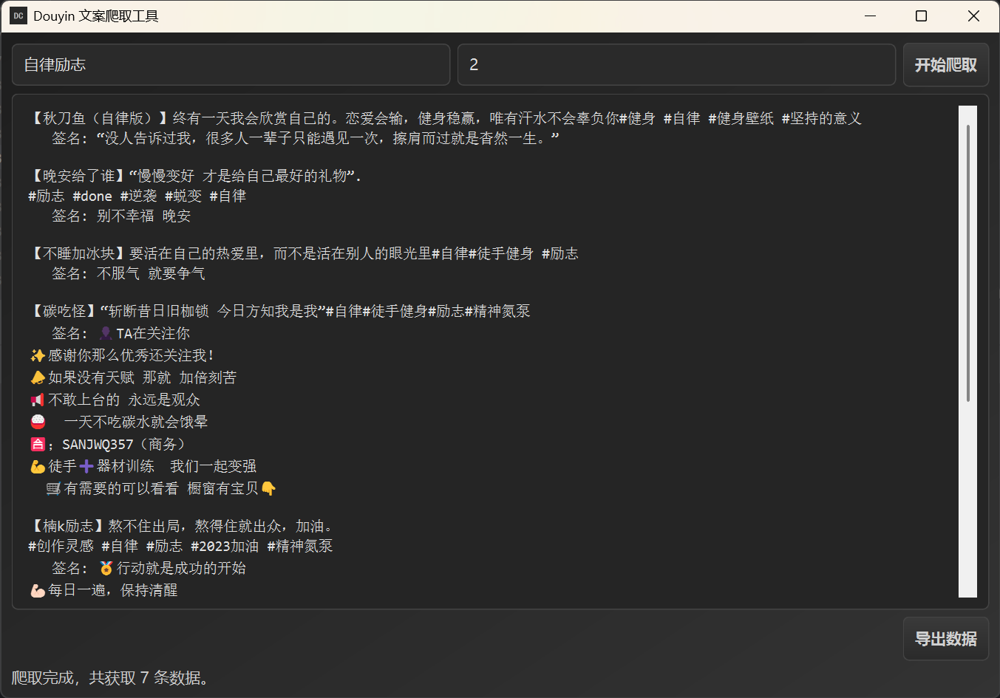

# 🎬 Douyin 数据爬取工具 🚀


一个基于 Python 的现代化 🕷️ 爬虫工具，专为抖音数据采集而设计！具有美观的渐变 UI 界面 🎨 和多线程支持 ⚡。

## ✨ 特性功能

- 🎯 **智能爬取** - 自动抓取抖音搜索结果的文案、作者和签名信息
- 🖥️ **美观界面** - 现代化渐变设计，视觉效果出众
- ⚡ **多线程支持** - 爬取过程不阻塞界面，流畅体验
- 💾 **双格式导出** - 支持 CSV 和 TXT 两种数据导出格式
- 🎨 **自定义图标** - 精美的 "DC" 标识应用图标
- 🛡️ **安全稳定** - 异常处理和用户提示完善

## 📦 安装依赖

```bash
# 克隆项目
git clone https://github.com/junior6666/PI-MAPP.git
cd project/Douyin_Crawling

```

安装依赖：

```bash
pip install PySide6 DrissionPage
```

## 🚀 快速开始

1. **运行应用**：
   ```bash
   python main_ui_plus.py
   ```

2. **输入参数**：
   - 🔍 在搜索框输入关键词（如：自律）
   - 📄 输入要爬取的页数

3. **开始爬取**：
   - 🟢 点击"开始爬取"按钮启动多线程爬虫
   - ⏹️ 可随时点击"停止爬取"中断过程

4. **导出数据**：
   - 💾 使用"导出CSV"或"导出TXT"按钮保存数据
   - 📊 数据自动格式化为易读结构

## 🖼️ 界面预览

> ✨ 精美的渐变背景和现代化按钮设计

## 📁 项目结构

```
Douyin_Crawling/
├── main_ui_plua.py    # 🎮 主程序文件
├── requirements.txt     # 📦 依赖列表
├── README.md           # 📖 说明文档
└── data/               # 💾 导出数据目录(运行时生成)
```

## 🛠️ 技术栈

- **PySide6** - 跨平台 GUI 框架
- **DrissionPage** - 网页自动化工具
- **QThread** - 多线程处理
- **CSV/TXT** - 数据导出格式

## 📋 使用示例

1. 输入搜索关键词："美食" 🍜
2. 设置爬取页数：5 📄
3. 点击"开始爬取" 🟢
4. 等待爬取完成 ✅
5. 导出为CSV文件 💾
## 📁 打包
```python
# 最精简的打包命令
pyinstaller --onefile --windowed --icon=icon1.ico --name "DouyinCrawler" --clean --hidden-import PySide6.QtXml --exclude-module tkinter --exclude-module matplotlib main_ui_plus.py

pyinstaller --onefile --windowed --icon=icon1.ico --name "DouyinCrawler2.0" --clean --hidden-import PySide6.QtXml --exclude-module tkinter --exclude-module matplotlib best_main_ui.py

```
## ⚠️ 注意事项

- 🚨 请遵守抖音的 robots.txt 协议
- 🔒 仅用于学习和研究目的
- ⚡ 爬取速度请设置为合理值，避免对服务器造成压力
- 💡 建议使用代理IP进行大规模爬取

## 🤝 贡献指南

欢迎提交 Issue 和 Pull Request！🎉

1. Fork 本项目
2. 创建特性分支：`git checkout -b feature/AmazingFeature`
3. 提交更改：`git commit -m 'Add some AmazingFeature'`
4. 推送分支：`git push origin feature/AmazingFeature`
5. 提交 Pull Request

## 📄 许可证

本项目采用 MIT 许可证 - 查看 [LICENSE](LICENSE) 文件了解详情

## 🙏 致谢

- [DrissionPage](https://github.com/g1879/DrissionPage) - 优秀的网页自动化工具
- [PySide6](https://www.qt.io/qt-for-python) - Qt for Python 官方绑定库
- 灵感来源：[UP主：轻松学Python](https://www.bilibili.com/video/BV1tH4y1c7Ca?spm_id_from=333.788.videopod.episodes&vd_source=ea444bcb59e16e58cfdca990f3514384&p=4)
- 所有贡献者和用户 🎊

## 免责声明
大家请以学习为目的使用本仓库，爬虫违法违规的案件：https://github.com/HiddenStrawberry/Crawler_Illegal_Cases_In_China
本项目的所有内容仅供学习和参考之用，禁止用于商业用途。任何人或组织不得将本仓库的内容用于非法用途或侵犯他人合法权益。本仓库所涉及的爬虫技术仅用于学习和研究，不得用于对其他平台进行大规模爬虫或其他非法行为。对于因使用本仓库内容而引起的任何法律责任，本仓库不承担任何责任。使用本仓库的内容即表示您同意本免责声明的所有条款和条件。

---

⭐ 如果这个项目对您有帮助，请给我们一个 star！这是对我们最大的鼓励！