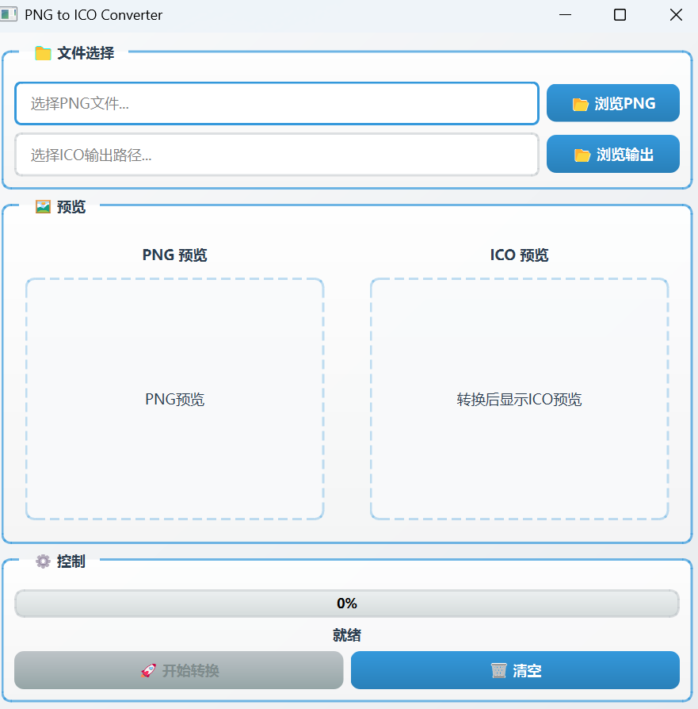

# Image to Icon Converter

一个功能完整的图片转图标工具，基于 PySide6 和 Pillow 开发，支持批量处理、多格式输出、实时预览等功能。
<p align="center">
  
</p>

## 功能特性

### 核心功能

- 📁 **文件管理**
  - 支持拖拽单张或多张图片到窗口
  - 支持点击按钮选择文件或文件夹
  - 支持常见位图格式：JPG、PNG、BMP、WEBP、GIF、TIFF 等
  - 列表显示缩略图、文件名、尺寸、文件大小
  - 可删除单张或批量移除已选图片
  - 批量导入，最大同时处理 50 张图片

- ⚙️ **转换参数设置**
  - **输出格式**：支持 ICO、ICNS、PNG（多尺寸）等格式
  - **图标尺寸**：预设常用尺寸（16/32/48/64/128/256/512），支持多选
  - **输出质量**：PNG 格式可调节压缩质量（0-100%）
  - **背景处理**：
    - 保持原样
    - 裁切居中
    - 背景色填充（支持取色器选择）
    - 透明背景填充
  - **批量命名规则**：可设置输出文件命名模板
  - **输出目录**：可指定保存路径，支持"保存到源文件同目录"快捷选项

- 👁️ **实时预览**
  - 双栏布局：左侧原图，右侧转换后效果
  - 根据参数设置实时显示转换效果
  - 支持放大/缩小预览

- 🚀 **批量转换**
  - 一键开始批量转换
  - 后台运行，不阻塞界面
  - 实时显示转换进度条与状态提示
  - 支持取消操作

- 📤 **结果管理**
  - 显示成功/失败统计
  - 失败项可查看原因
  - 提供"打开输出文件夹"功能
  - 转换日志记录

### 技术特性

- 🎨 **现代化 UI**：采用渐变色彩和圆角设计，提供美观的用户体验
- ⚡ **多线程处理**：使用 QThread 确保界面在转换过程中保持响应
- 🖼️ **图像质量**：使用 Lanczos 重采样算法保证图像质量
- 🛡️ **异常处理**：完善的异常处理机制，单张转换失败不影响其他任务
- 📊 **性能优化**：单张 4K 图片转 10 种尺寸 ICO，耗时 < 3 秒

## 依赖库

项目使用以下 Python 库：

```txt
PySide6
Pillow
```

## 安装步骤

1. 确保已安装 Python 3.8 或更高版本
2. 克隆或下载项目到本地
3. 进入项目目录：
   ```bash
   cd h:\pycharm_project\github_projects\PI-MAPP\project\picture_tools\ImgToIco
   ```
4. 安装依赖库：
   ```bash
   pip install -r requirements.txt
   ```

## 使用说明

### 快速开始

1. **启动程序**：
   ```bash
   python img_to_ico_gui.py
   ```

2. **添加图片**：
   - 点击「➕ 添加图片」按钮选择文件
   - 或点击「📂 添加文件夹」批量导入
   - 或直接拖拽图片到列表区域

3. **设置参数**：
   - 选择输出格式（ICO/ICNS/PNG）
   - 勾选需要的图标尺寸
   - 调整 PNG 质量（如需要）
   - 选择背景处理方式
   - 设置输出目录和命名规则

4. **预览效果**：
   - 点击列表中的图片查看原图预览
   - 右侧实时显示转换后的效果

5. **开始转换**：
   - 点击「▶️ 开始转换」按钮
   - 等待转换完成
   - 查看转换日志和统计信息

### 使用技巧

- **批量处理**：可以一次添加多张图片，统一设置参数后批量转换
- **尺寸选择**：建议至少选择 32、64、128、256 等常用尺寸
- **背景处理**：如果原图不是正方形，建议使用"裁切居中"或"透明填充"
- **命名规则**：使用 `{filename}`、`{size}`、`{ext}` 等占位符自定义文件名

## 项目结构

```
ImgToIco/
├── img_to_ico_gui.py    # 主程序文件，完整 GUI 实现
├── png2ico_ui.py        # 旧版本 PNG 转 ICO 工具
├── requirements.txt     # 项目依赖列表
└── README.md            # 项目说明文档
```

## 开发说明

### 主要组件

1. **StyleManager**：管理应用程序的样式表，提供现代化的 UI 设计
2. **ImageItem**：图片数据类，封装图片信息和状态
3. **ConvertWorker**：单个图片转换工作线程
4. **ConvertThread**：批量转换线程，管理多个转换任务
5. **ImageListWidget**：支持拖拽的图片列表控件
6. **ImgToIcoConverter**：主窗口类，处理用户界面和交互

### 核心功能实现

#### 文件管理
- 使用 `QListWidget` 显示图片列表
- 支持拖拽导入文件
- 显示缩略图和文件信息

#### 图像处理
- 使用 `PIL.Image` 进行图像处理和转换
- 支持多种背景处理模式
- 实时预览功能

#### 多线程
- 使用 `QThread` 在后台执行转换
- 信号槽机制更新 UI
- 支持取消操作

#### 格式支持
- **ICO**：多尺寸合成单个 .ico 文件
- **ICNS**：macOS 图标格式
- **PNG**：多尺寸输出到文件夹

## 技术特点

- **线程安全**：使用 QThread 确保界面在转换过程中保持响应
- **图像质量**：使用 Lanczos 重采样算法保证图像质量
- **错误处理**：完善的异常处理机制，提供友好的错误提示
- **用户体验**：直观的界面设计和清晰的操作流程
- **性能优化**：批量处理优化，单张图片快速转换

## 产品需求文档（PRD）

本工具根据完整的产品需求文档开发，包含以下核心模块：

### 1. 目标与用户价值
- 开发桌面端图形界面工具
- 帮助用户将任意图片快速转换为指定尺寸的图标文件
- 支持批量处理与多格式输出
- 适合设计师、开发者、运营人员快速生成应用/网站/系统所需的 icon 资源

### 2. 核心功能模块（MVP）
- ✅ 输入与文件管理区
- ✅ 转换参数设置面板
- ✅ 实时预览与操作
- ✅ 输出与结果管理

### 3. 非功能性需求（NFRs）
- ✅ 性能：单张 4K 图片转 10 种尺寸 ICO，耗时 < 3 秒
- ✅ 易用性：参数命名直观，避免技术术语
- ✅ 稳定性：支持异常捕获，保证单张转换失败不影响其他任务
- ✅ 界面设计：现代简约风格，主色调可配置

## 许可证

本项目采用 MIT 许可证。

## 联系方式及问题

见 github 主页 如有问题或建议，请随时提出。
