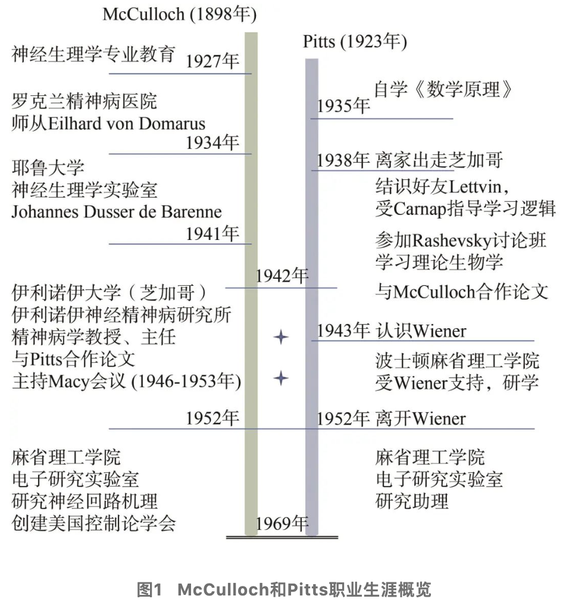

# 解读上链接：https://blog.sciencenet.cn/blog-2374-1400910.html
# 原论文链接：https://www.cs.cmu.edu/~epxing/Class/10715/reading/McCulloch.and.Pitts.pdf
# 原论文题目：（A logical calculus of the ideas immanent in nervous activity）（以下简称M-P论文）
## 摘要：

1943年，Warren McCulloch和Walter Pitts发表论文《神经活动内在思想的逻辑演算》，证明可以使用逻辑演算描述神经网络的运行机理，拓展了计算神经科学的领域前沿，奠定了人工神经网络的发展基础。恰逢M-P论文发表80周年之际，结合时代背景和作者学术生涯的变迁，探索M-P理论的思想源泉；借助原文中的示例，概述M-P模型的基本原理；以作者对循环因果和反馈机制的研究为主线，探讨M-P模型对信息科学发展的影响、对控制论发展的贡献，及其在当今人工智能大模型时代的意义。
关键词： M-P模型；人工神经网络；循环因果；控制论；平行系统；人工智能

## 0 引言
人工智能历史上经历了3次繁荣：第一次是1957年罗森布莱特（Frank Rosenblatt）提出感知器Perceptron模型，首次通过神经元网络体现出了机器学习的能力；第二次是20世纪80年代初，霍普菲尔德（John Hopfield）引领神经网络的复兴，以罗梅尔哈特（David Rumelhart）等人为代表的PDP学派在1986年重新提出神经网络的反向传播（BP）学习算法，人工智能迎来第二个春天；第三次是2010年前后由辛顿（Geoffrey Hinton）开启的深度学习时代，从2012年的AlexNet，到2017年谷歌提出Transformer，再到2022年年底OpenAI推出ChatGPT，人工神经元网络经历寒冬，两落两起，终于将人工智能带到了历史的转折点。回顾人工智能曲折的发展历程，人工神经网络在人工智能的每一次萌芽、复苏、繁荣中，都扮演着至关重要的角色。而追溯人工神经网络的源头，是由神经生理学家麦卡洛克（Warren S. McCulloch）与自学成才的数学家皮茨（Walter Pitts）提出的神经网络逻辑演算模型。1943年，McCulloch和Pitts一同发表论文《神经活动内在思想的逻辑演算》（A logical calculus of the ideas immanent in nervous activity）（以下简称M-P论文），首次提出通过逻辑演算来解释神经机制如何实现心理功能。人们将这篇论文中提出的神经网络模型，以作者姓氏首字母命名为“M-P模型”。M-P模型不但是人工神经元网络的源头，而且也启发了计算机、控制论和人工智能等多个学科的开创，打开了现代信息科学殿堂的大门。

然而从今天的学术视角来看，M-P论文晦涩难懂，对论文的深入分析也不多见。其原因主要有3点：首先，论文本身是神经生理学和逻辑的融合，学科交叉特点明显，读者需要具备两个学科领域的基础知识；其次，论文中使用的逻辑符号、神经网络的图标均与今天人们所熟悉的形式有较大区别，造成阅读和理解上的困难；第三，M-P论文只是作者一个时期的工作总结，只有全面了解两位作者的整个研究生涯，以及作者所处的科学研究时代背景，才能对M-P模型的思想和意义有较为深入的理解。

正值M-P论文发表80周年之际，本文探索M-P模型的思想源头，浅析M-P模型的基本原理，讨论M-P模型对后世信息科学的深远影响，希望能引人思考，启发对智能本质的未来探索。

## 1 M-P模型的起源
M-P模型源于McCulloch对用神经机制解释心智现象的追求与探索，在与Pitts合作不到两年的时间内，便发表了M-P论文。图1给出了McCulloch和Pitts职业生涯的主要经历。本节通过介绍两位作者所处的时代背景和关键人物，帮助读者理解McCulloch的核心思想以及Pitts在其中的贡献。

### 1.1   麦卡洛克（McCulloch）

McCulloch出生于1898年，幼年开始接受良好的教育，职业生涯相对平稳顺利。在攻读神经生理学和精神病学学位期间，McCulloch开始思考有形的生物神经系统如何产生无形的心智，即“身体-心智”（body-mind）问题，这在当时是一个几乎空白的领域。McCulloch提出了“精神原子”（psychon）的概念，它类似于物理学中的原子，McCulloch认为精神原子是心智的最基本元素。精神原子包含的信息是命题式的（真或假），并且能够在不同精神原子之间按照因果关系时序传递。

1927年，McCulloch获得医学博士学位（MD），开始神经生理学职业道路。随后的一年，McCulloch在纽约一家医院实习，开始对神经系统中的闭环回路（closed loop）产生了兴趣。McCulloch当时认为，人类某些疾病（例如帕金森病）的颤抖症状，可能是由神经闭环回路造成的。神经系统中闭环回路的功能和机理也成为McCulloch职业生涯中长期关注的问题。

自1928年起，McCulloch在罗克兰精神病医院工作。在这期间，McCulloch想到，每个神经元向其相邻神经元传递的“全有或全无”（all-or-none）电脉冲信号，可能对应于他所提出的精神原子；而神经元之间通过电脉冲信号实现的“兴奋或抑制”相互作用，对应基于精神原子的命题逻辑推理演算。也就是说，McCulloch认为大脑是按照逻辑演算方式工作的，进而实现信息感知能力、数学和抽象思维能力。

1934年，McCulloch进入耶鲁大学神经生理学实验室，跟随著名神经生理学家Johannes Dusser de Barenne，完成了关于大脑皮层中闭环回路、皮层功能定位等重要研究。尽管当时的生物学研究进展迅速，但大多数研究集中在揭示纯生物学意义上的物理化学现象，而对大脑更高级的活动（例如学习）知之甚少，没有任何理论可以解释心智是如何出现的。

在耶鲁大学，McCulloch积极学习逻辑，参加了一系列哲学家的讨论班。但是他所掌握的逻辑知识还不足以支撑他的理论设想，特别是神经系统中的闭环回路工作机理尚不清楚，通过逻辑演算难以处理。直到1941年他搬去芝加哥，与Pitts合作，这一问题才有了解决方案。
### 1.2 拉舍夫斯基（Rashevsky）

20世纪30年代，芝加哥大学理论物理学家拉舍夫斯基（Nicolas Rashevsky）创建了数学生物学和数学生物物理学。与经典生物学研究侧重实验研究不同，这一新领域仅借助数学从理论上研究生物行为。Rashevsky希望将理论物理学的研究方式应用到生物学领域，对高度理想化的生物系统进行数学描述。尽管经典生物学家指责这种方法不切实际，但Rashevsky坚持认为理想模型仍然具有了与真实模型一样的核心属性，通过对问题的简化，可以逐步找到解决方案，进而解决现实问题。

Rashevsky同样关注McCulloch考虑的“身体-意识”问题。1936年，Rashevsky发表《Mathematical biophysics and psychology》一文，尝试基于抽象化的神经元来建立神经网络的数学模型。Rashevsky的神经网络模型基于以下假设。

* 神经元有两种类型：兴奋型或抑制型。大脑是由相互联系的神经元组成的，神经元在受到刺激时会产生兴奋性或抑制性物质，从而影响网络中与之相连的神经元状态。
* 神经元遵循全有或全无法则：当接受的兴奋性物质浓度与抑制性物质浓度之比大于1时，神经元才会兴奋。浓度由微分方程基于输入信号推导得出。
* 神经的阈值因先前的兴奋而永久降低（体现学习能力）。

从以上假设可以看出，Rashevsky的论文与7年后发表的M-P论文有许多相似之处。例如两者都采用神经元状态“all-or-none”准则，神经元根据所受外部输入（激励或抑制）的累加结果，与阈值相比较后决定输出。

不同之处主要有两点：首先，Rashevsky模型中，神经元输出信号的兴奋或抑制性质是固定的，而在M-P模型中，神经元输出信号是兴奋或抑制，仅取决于建立连接的位置。这表明McCulloch和Pitts比Rashevsky更远离现实，在这一点上，他们的处理方式更简化、更抽象；其次，更重要的一点是两者采用的数学工具不同。Rashevsky模型需要建立并求解微分方程，M-P模型是基于命题表示与逻辑演算的。从Rashevsky模型到M-P模型，微分方程被更简单的逻辑命题所取代，是从“连续”到“离散（二值）”、从“模拟”到“数字”的转变。基于逻辑的模型适合用图灵提出的计算理论进行分析，可与图灵讨论的智能关联起来，这也是M-P模型成为人工智能起源的重要原因。

1939年，Rashevsky创建了世界上第一份数学生物学国际期刊，即《数学生物物理学会刊》（Bulletin of Mathematical Biophysics）。4年之后，McCulloch和Pitts的论文正是在此期刊上发表的。
。。。。看解读的原链接吧

